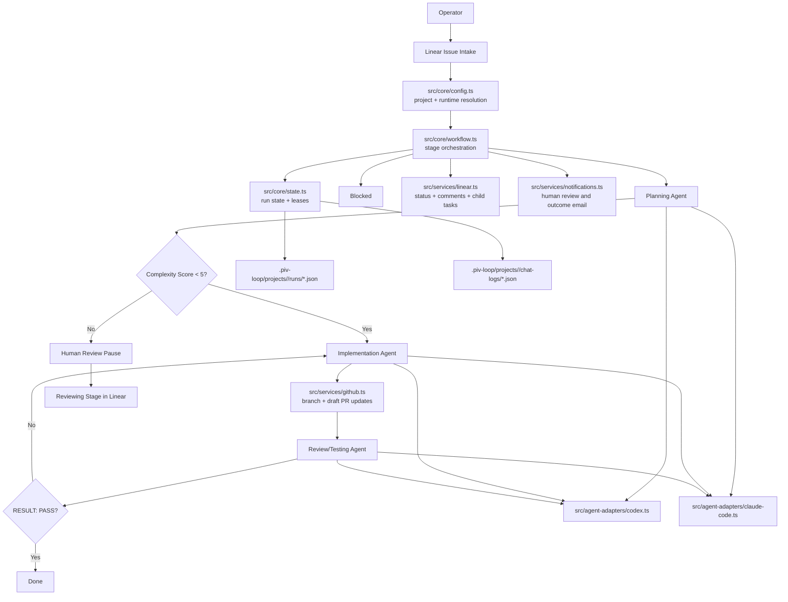

# Architecture

## System Purpose

ADHD.ai is a multi-project orchestration hub that pulls eligible Linear issues and executes a staged agent loop: planning, implementation, and review/testing.

## Ownership Boundaries

1. `src/core/config.ts` is the only runtime config resolver for env vars and config files.
2. `src/core/workflow.ts` owns stage transitions, retries, and orchestration order.
3. Integration modules stay isolated under `src/services/` and `src/agent-adapters/`:
   - `src/services/linear.ts`
   - `src/services/github.ts`
   - `src/agent-adapters/codex.ts`
   - `src/agent-adapters/claude-code.ts`
   - `src/services/cron.ts`
   - `src/services/notifications.ts`
4. `src/core/state.ts` owns run-state paths and legacy fallback behavior.
5. `src/args.ts` and `src/index.ts` own CLI parsing and command dispatch with command handlers in `src/commands/`.

## Stage Model

The workflow advances through planning -> implementing -> review/testing and synchronizes Linear status and comments at each boundary. Review output must preserve the parsing contract:

- `RESULT: PASS|FAIL`
- `SUMMARY: ...`
- `BUGS_JSON: [...]`

## System Diagram

## Multi-Project Runtime Rules

1. Every run resolves to one or more `project.id` values.
2. Run state is persisted under `.piv-loop/projects/<project-id>/runs`.
3. Status reads require an explicit project id.
4. Default invocation without project flags targets the first configured project.
5. `--all-projects --issue <KEY>` must resolve to one unique project mapping.

## Integration Flow

1. Linear issues are fetched and routed by project config and optional `linear.projectId`.
2. Planning prompt is built from issue context and skill input.
3. Optional planning skill auto-selection can append supplemental skills from `skills.root` and/or a SQLite skills catalog when `skills.autoSelect.enabled` is true.
4. Implementation session applies code changes and creates/updates PR context.
5. Review/testing session emits structured pass/fail output and bug payload.
6. Failed verification feeds back into implementation until pass or blocked.
