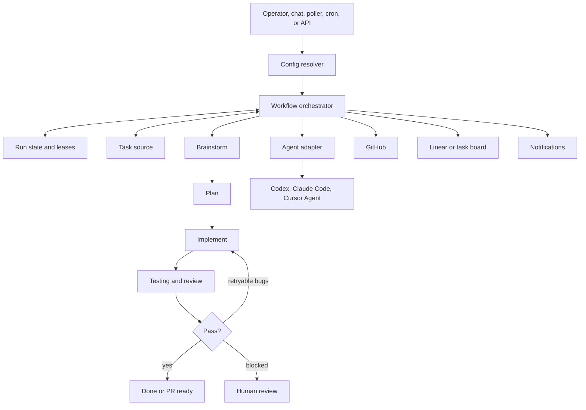

# devos.ing

Talk is cheap, show me your agent system.

[Quickstart](#quickstart) | [Terms](docs/TERMS.md) | [Operator Guide](docs/NON_TECHNICAL_GUIDE.md) | [Architecture](ARCHITECTURE.md) | [CLI Reference](packages/cli/README.md) | [Security](docs/SECURITY.md)

[](LICENSE)
[](https://bun.sh)

# devos.ing is the local control plane for loop engineering.

Open-source orchestration for coding-agent loops, workflow daemons, task intake,
and operator review.

**If a coding agent is a worker, devos.ing is the loop bench.**

devos.ing turns product and engineering requests into repeatable agent runs that
can brainstorm, plan, implement, review, test, and report progress across one or
more projects while keeping a human operator in control.

Loop engineering is the practice of turning messy product or engineering intent
into observable agent loops: route the work, run the phases, inspect evidence,
feed failures back, and stop only when the outcome is done or explicitly blocked.

It looks like a CLI and local web UI. Under the hood: project routing, workflow
state, agent adapters, task intake, skills, run leases, review loops, secrets,
and a daemon that keeps the system alive.

**Manage agent loops, not terminal chaos.**

| Step | Example |
| --- | --- |
| **01** Define the request | "Add retry handling for flaky API calls." |
| **02** Route the work | Pick the project, repo, branch, skills, and agent runtime. |
| **03** Run the loop | Brainstorm, plan, implement, test, and review with checkpoints. |
| **04** Inspect the outcome | Read logs, run state, PR context, blockers, and verification evidence. |

Works with Codex, Claude Code, Cursor Agent, GitHub, Linear, local web apps,
scheduled jobs, and adapter-backed runtimes. If it can be invoked through a
structured adapter, devos.ing can coordinate it.

## devos.ing is right for you if

- You coordinate coding agents across more than one repo or project.
- You want agent runs to start from project context instead of fresh terminal
  improvisation.
- You want a default loop from brainstorm to plan, implementation, testing,
  and review.
- You need run state, logs, leases, errors, and PR context to survive restarts.
- You want browser-driven commands and chat workflows backed by the same worker
  path as CLI runs.
- You want local-first secrets and config, with operator review points instead
  of unattended mystery changes.
- You want scheduled or polling agent loops without rebuilding orchestration in
  each repository.

## Features

### Bring Your Own Agent

Use Codex, Claude Code, Cursor Agent, or another runtime through adapter
boundaries. Workflow logic stays separate from the agent that executes a phase.

### Project-Aware Routing

Projects bind workspace paths, repository details, task sources, skills, agent
backends, and workflow defaults so commands do not need project-specific flags.

### Loop Engineering Pipeline

The default workflow moves work through `brainstorm`, `plan`, `implement`,
`testing`, and `githubComment`, with retry and blocked states where they belong.

### Run State And Leases

Per-project state tracks current phase, agent sessions, chat logs, errors,
leases, and progress under `.devos/projects/<project-id>/`.

### Local Web UI

The browser UI talks to the server and workflow worker through the same command
path operators use locally, so chat workflows and button-driven actions are
auditable.

### Production-Style Daemon

`devos daemon` runs the server, web UI, worker, and poller together after build
artifacts exist, making local automation feel like the real deployment shape.

### Task Intake

Loose requests can become structured backlog issues through the configured
intake flow, including clarification rounds when requirements are still unclear.

### Skills And Plugins

Skills and plugin templates give agents reusable process knowledge and local
tooling without hard-coding one project's workflow into the platform.

## Problems devos.ing solves

| Without devos.ing | With devos.ing |
| --- | --- |
| You have several agent terminals open and lose track of who is doing what. | Runs are attached to issues, projects, phases, logs, and durable state. |
| Every repo needs its own fragile scripts and handoff rules. | Workflow behavior stays project-agnostic while project config supplies routing. |
| Agents restart without the context that made the work meaningful. | Run state, task context, skills, and phase history travel with the workflow. |
| Planning, implementation, review, and testing happen as ad hoc prompts. | Loop engineering gives each phase a clear purpose, checkpoint, and feedback path. |
| Browser commands and CLI commands drift into separate systems. | The web UI, server, worker, daemon, and CLI share the same orchestration path. |
| Secrets and local config leak into prompts or repo files. | Onboarding stores secrets and trusted instance config under `~/.devos/config`. |
| Polling and scheduled work need custom glue. | The poller, cron runner, leases, and daemon provide a repeatable automation loop. |

## Why devos.ing is special

devos.ing handles the hard loop engineering details that are easy to underbuild.

| System detail | Why it matters |
| --- | --- |
| **Project-agnostic workflows** | One platform can coordinate many repos without coupling logic to a single workspace. |
| **Structured agent adapters** | Runtimes can change without rewriting the workflow pipeline. |
| **Persistent run state** | Operators can inspect, resume, retry, or debug runs after restarts. |
| **Human checkpoints** | Blocked work pauses for review instead of pretending uncertainty is success. |
| **Shared CLI and web path** | Browser actions stay tied to the same worker and logs as terminal commands. |
| **Local-first config** | Secrets and instance settings stay on the machine unless a run explicitly needs them. |
| **Bun-only monorepo tooling** | Package management, scripts, tests, and workspace filters stay consistent. |

## What's under the hood

devos.ing is a control plane, not a prompt wrapper.



### The Systems

**CLI and onboarding** - Parses commands, guides local setup, validates tools,
stores secrets, resolves config, and starts workflow runs.

**Server and realtime API** - Owns HTTP routes, readiness, workflow websocket
behavior, cron runtime, daemon bridge, repositories, and API tests.

**Workflow worker** - Connects to the server, receives workflow commands, runs
agent phases, and streams progress back to operators.

**Agent adapters** - Normalize Codex, Claude Code, Cursor Agent, and other
runtime outputs behind structured command arguments.

**Database package** - Owns shared schema, migrations, helpers, seed scripts,
backup, and local instance data.

**Web UI** - Gives operators a local dashboard for projects, sessions, chat,
settings, realtime events, and browser-driven workflow actions.

**Landing and installer** - Serves the public landing site and hosted CLI
installer at `https://devos.ing/cli`.

**Skills and plugins** - Provide reusable agent process knowledge and bundled
plugin templates for local tool installation and validation.

## What devos.ing is not

| Not this | The difference |
| --- | --- |
| **Not a chatbot** | Chat is one interface, not the unit of work. Runs are tied to projects, phases, and evidence. |
| **Not a single-agent wrapper** | devos.ing coordinates runtimes, task sources, config, state, and review across projects. |
| **Not a hosted-only service** | The default path is local-first, with secrets and instance config stored on your machine. |
| **Not a drag-and-drop workflow builder** | The pipeline is code-defined and project-agnostic, built for engineering work. |
| **Not a replacement for review** | The platform keeps humans in control with checkpoints, logs, and explicit blockers. |

## Quickstart

Install the published CLI with the hosted bash installer:

```bash
curl -fsSL https://devos.ing/cli | bash
```

Run guided onboarding. The wizard writes local instance config and stores
secrets under `~/.devos/config`.

```bash
devos onboard
devos daemon
```

Run one scoped workflow:

```bash
devos run --issue ENG-123
```

If you want devos.ing to keep polling for eligible work:

```bash
devos run --poll
devos run --poll-forever
```

Run `devos onboard --check` after any config change. It validates config,
tooling, GitHub auth, agent runtime availability, and secret placement.

## Prerequisites

The installer and onboarding flow handle as much setup as possible, but real
workflow runs need a few local tools and credentials:

- Bun `>=1.3.0` for this monorepo and package scripts.
- GitHub CLI authenticated with `gh auth login` when workflows touch GitHub.
- RTK available for token-optimized agent shell execution.
- At least one configured coding-agent runtime, such as Codex, Claude Code, or
  Cursor Agent.
- Project credentials and routing details for the systems you use, such as
  Linear, GitHub, and optional Resend notifications.

## Development

Clone the repo, install dependencies with Bun, build the local CLI package, and
validate onboarding.

```bash
bun install
bun run build
devos help
devos onboard
devos onboard --check
```

Start the local development stack:

```bash
bun run dev
```

That command starts:

- API server on `http://localhost:3001`.
- Web UI on `http://localhost:3000`.
- Workflow worker connected to `/api/workflow`.

If the web UI reports `No CLI worker connected to /api/workflow`, keep the
server running and start the worker:

```bash
bun run dev:worker
```

The worker connects to `ws://127.0.0.1:3001/api/workflow` by default. Override
the local targets when needed:

```bash
DEVOS_SERVER_BASE_URL=http://127.0.0.1:3001
DEVOS_WORKFLOW_WS_URL=ws://127.0.0.1:3001/api/workflow
```

To run the full local development stack in Docker:

```bash
docker compose up
```

The Compose stack exposes the web UI at `http://localhost:3000`, the API server
health endpoint at `http://localhost:3001/health`, the workflow worker connected
to `ws://server:3001/api/workflow`, and the landing site at
`http://localhost:3002`.

Stop it with:

```bash
docker compose down
```

## Common Commands

```bash
# guided setup and validation
devos onboard
devos daemon
devos onboard --check

# run one issue or the configured queue
devos run --issue ENG-123
devos run

# poll continuously for work
devos run --poll
devos run --poll-forever

# inspect run state
devos status --issue ENG-123

# inspect GitHub releases and create a tag-only release marker
devos release list --limit 10
devos release tag v0.0.2 --message "Release v0.0.2"

# create a task through the configured intake flow
devos task create --request "Add retry handling for API timeouts"
```

For full command details, read [packages/cli/README.md](packages/cli/README.md).

## Repository Map

- `packages/cli/`: CLI parsing, onboarding, config resolution, workflow
  orchestration, daemon helpers, task intake, skills, and integrations.
- `packages/server/`: HTTP API, realtime/websocket behavior, cron runtime,
  workflow-data boundaries, repositories, and server tests.
- `packages/web/`: Next.js operator UI, client data access, realtime state,
  providers, components, and frontend tests.
- `packages/db/`: Shared database schema, migrations, helpers, and DB scripts.
- `packages/landing/`: Public landing site and hosted CLI installer route.
- `packages/agent-adapters/`: Runtime adapters for Codex, Claude Code, Cursor
  Agent, and normalized agent output contracts.
- `packages/agents/`: Shared agent/session/guardrail primitives.
- `packages/create-devos-plugin/`: Plugin scaffolding package.
- `packages/workflow/`: Workflow scaffolding/runtime package.

## Quality Checks

Run these before opening or updating a PR:

```bash
bun run check
bun run typecheck
bun test
```

Useful focused checks:

```bash
bun run --filter devos typecheck
bun run --filter devos-server check
bun run --filter devos-server typecheck
bun run --filter devos-server test
bun test packages/cli/tests/smoke-flow.test.ts
```

## More Documentation

- [docs/TERMS.md](docs/TERMS.md): product terminology for loop engineering,
  workflow loops, and operator checkpoints.
- [docs/NON_TECHNICAL_GUIDE.md](docs/NON_TECHNICAL_GUIDE.md): operator-friendly
  guide to the system and workflow.
- [docs/workspace-cli-commands.md](docs/workspace-cli-commands.md): full CLI
  command reference.
- [docs/product-specs/new-user-onboarding.md](docs/product-specs/new-user-onboarding.md):
  expected new-user onboarding flow.
- [ARCHITECTURE.md](ARCHITECTURE.md): system boundaries and workflow model.
- [docs/RELIABILITY.md](docs/RELIABILITY.md): reliability and run behavior.
- [docs/SECURITY.md](docs/SECURITY.md): secrets and security expectations.
- [docs/PLANS.md](docs/PLANS.md): active operating plans.
- [docs/QUALITY_SCORE.md](docs/QUALITY_SCORE.md): quality posture.

## Star History

<a href="https://www.star-history.com/?repos=0xroylee%2Fdevos.ing&type=date&legend=top-left">
 <picture>
   <source media="(prefers-color-scheme: dark)" srcset="https://api.star-history.com/chart?repos=0xroylee/devos.ing&type=date&theme=dark&legend=top-left" />
   <source media="(prefers-color-scheme: light)" srcset="https://api.star-history.com/chart?repos=0xroylee/devos.ing&type=date&legend=top-left" />
   
 </picture>
</a>
