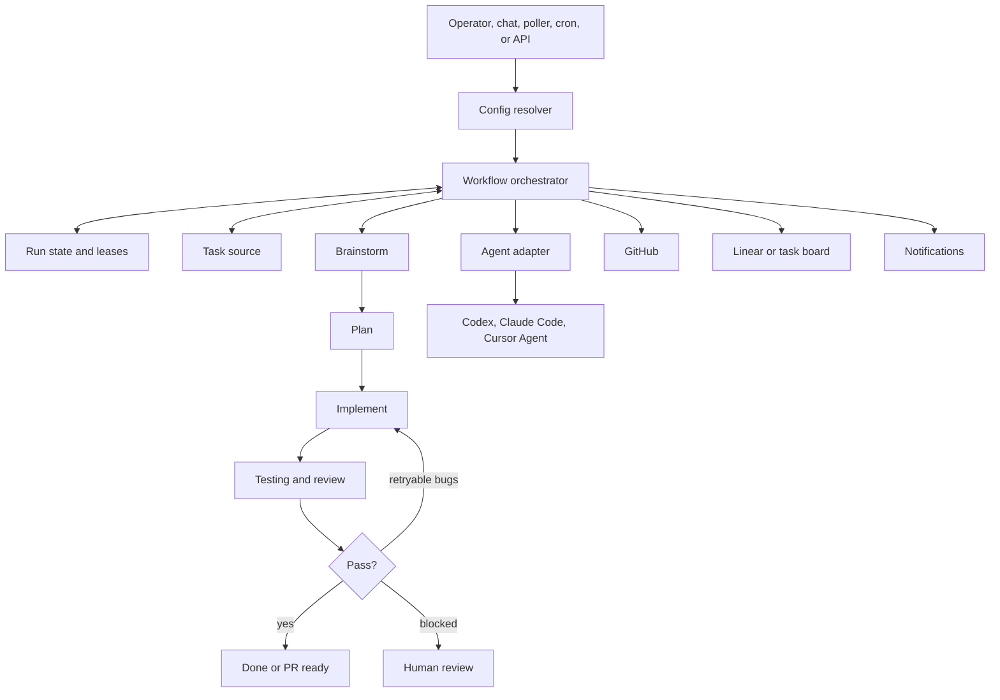

# devos.ing

Talk is cheap, show me your agent system.

devos.ing is ADHD: Agentic Development Hub & Daemon. It turns product and
engineering work into a repeatable agent workflow that can plan, implement,
review, test, and report progress across one or more projects while keeping a
human operator in control.

## What We Are Solving

Modern coding agents are powerful, but production work still gets stuck in the
same places: unclear task intake, missing project context, manual handoffs
between planning and implementation, inconsistent review quality, lost run
state, and brittle scripts that only work in one repo.

devos.ing gives teams a local-first control plane for that work:

- Turn issues or chat requests into structured engineering tasks.
- Route work to the right project, repository, branch, skills, and agent model.
- Run the default workflow from brainstorm to plan, implement, and testing.
- Keep run state, logs, PR context, and human review points visible.
- Operate from the CLI, local web UI, daemon, poller, or scheduled cron jobs.
- Keep workflow behavior project-agnostic so one platform can coordinate many
  repos.

For a non-technical operator guide, start with
[docs/NON_TECHNICAL_GUIDE.md](docs/NON_TECHNICAL_GUIDE.md).

## Install And First Run

Install the published CLI with the hosted bash installer:

```bash
curl -fsSL https://devos.ing/cli | bash
```

Run guided onboarding. The wizard writes local instance config and stores
secrets under `~/.devos/config`.

```bash
devos onboard
devos daemon
```

Run one scoped workflow.

```bash
devos run --issue ENG-123
```

If you want devos.ing to keep polling for eligible work:

```bash
devos run --poll
devos run --poll-forever
```

## Prerequisites

The installer and onboarding flow handle as much setup as possible, but real
workflow runs need a few local tools and credentials:

- Bun `>=1.3.0` for this monorepo and package scripts.
- GitHub CLI authenticated with `gh auth login` when workflows touch GitHub.
- RTK available for token-optimized agent shell execution.
- At least one configured coding-agent runtime, such as Codex, Claude Code, or
  Cursor Agent.
- Project credentials and routing details for the systems you use, such as
  Linear, GitHub, and optional Resend notifications.

Run `devos onboard --check` after any config change. It validates config,
tooling, GitHub auth, agent runtime availability, and secret placement.

## Core Concepts

### Project

A project is a configured work lane. It binds workspace paths, repository
settings, task sources, skills, agent backends, and workflow defaults so devos.ing
can route work without each command carrying project-specific flags.

### Workflow

The default workflow is the agent pipeline that moves a task forward:

1. `brainstorm`: clarify intent and identify missing requirements.
2. `plan`: turn task context into a concrete implementation goal.
3. `implement`: change code and prepare PR context.
4. `testing`: verify the result and produce structured pass/fail feedback.
5. `githubComment`: write PR-facing review or status comments when needed.

Failed review can loop back into implementation with bug feedback. Blocked work
pauses for human review instead of silently continuing.

### Agent Runtime

Agent runtimes execute workflow stages. devos.ing keeps the orchestration logic
separate from runtime adapters so a project can use Codex, Claude Code, Cursor
Agent, or another supported backend without rewriting workflow code.

### Worker And Daemon

The web UI and server dispatch commands through a workflow websocket. A worker
must be connected for browser-driven commands and chat workflows. `devos daemon`
runs the production-style server, web UI, workflow worker, and poller together
after build artifacts exist.

### State And Secrets

Onboarding stores:

- Secrets in `~/.devos/config/env.sqlite`.
- Local trusted instance config in `~/.devos/config/instance.config.json`.
- Per-project run state under `.devos/projects/<project-id>/`.

Run state includes leases, current phase, agent sessions, chat logs, errors, and
workflow progress.

## Common Commands

### Operator Commands

```bash
# guided setup and validation
devos onboard
devos daemon
devos onboard --check

# run one issue or the configured queue
devos run --issue ENG-123
devos run

# poll continuously for work
devos run --poll
devos run --poll-forever

# inspect run state
devos status --issue ENG-123

# inspect GitHub releases and create a tag-only release marker
devos release list --limit 10
devos release tag v0.0.2 --message "Release v0.0.2"

# create a task through the configured intake flow
devos task create --request "Add retry handling for API timeouts"
```

### Local App Commands

```bash
# start API server, web UI, and workflow worker together
bun run dev

# start only one side of the local stack
bun run dev:server
bun run dev:web
bun run dev:worker

# production-style local daemon after build artifacts exist
devos daemon

# server-owned scheduled automation runner
bun run --filter devos-server cron
bun run cron:once
```

### Skill Commands

```bash
devos skills list
devos skills add --title "<TITLE>" --description "<DESCRIPTION>" --content "<CONTENT>"
devos skills update <NAME> [--title "<TITLE>"] [--description "<DESCRIPTION>"] [--content "<CONTENT>"]
devos skills remove <NAME>
```

## Local Contributor Setup

Clone the repo, install dependencies with Bun, build the local CLI package, and
validate onboarding.

```bash
bun install
bun run build
devos help
devos onboard
devos onboard --check
```

Start the local development stack:

```bash
bun run dev
```

That command starts:

- API server on `http://localhost:3001`.
- Web UI on `http://localhost:3000`.
- Workflow worker connected to `/api/workflow`.

If the web UI reports `No CLI worker connected to /api/workflow`, keep the
server running and start the worker:

```bash
bun run dev:worker
```

The worker connects to `ws://127.0.0.1:3001/api/workflow` by default. Override
the local targets when needed:

```bash
DEVOS_SERVER_BASE_URL=http://127.0.0.1:3001
DEVOS_WORKFLOW_WS_URL=ws://127.0.0.1:3001/api/workflow
```

To run the full local development stack in Docker:

```bash
docker compose up
```

The Compose stack exposes the web UI at `http://localhost:3000`, the API server
health endpoint at `http://localhost:3001/health`, the workflow worker connected
to `ws://server:3001/api/workflow`, and the landing site at
`http://localhost:3002`.

Stop it with:

```bash
docker compose down
```

## Repository Map

- `packages/cli/`: CLI parsing, onboarding, config resolution, workflow
  orchestration, daemon helpers, task intake, skills, and integrations.
- `packages/server/`: HTTP API, realtime/websocket behavior, cron runtime,
  workflow-data boundaries, repositories, and server tests.
- `packages/web/`: Next.js operator UI, client data access, realtime state,
  providers, components, and frontend tests.
- `packages/db/`: Shared database schema, migrations, helpers, and DB scripts.
- `packages/landing/`: Public landing site and hosted CLI installer route.
- `packages/agent-adapters/`: Runtime adapters for Codex, Claude Code, Cursor
  Agent, and normalized agent output contracts.
- `packages/agents/`: Shared agent/session/guardrail primitives.
- `packages/create-devos-plugin/`: Plugin scaffolding package.
- `packages/workflow/`: Workflow scaffolding/runtime package.

## Architecture At A Glance



For the deeper design, read [ARCHITECTURE.md](ARCHITECTURE.md).

## Quality Checks

Run these before opening or updating a PR:

```bash
bun run check
bun run typecheck
bun test
```

Useful focused checks:

```bash
bun run --filter devos typecheck
bun run --filter devos-server check
bun run --filter devos-server typecheck
bun run --filter devos-server test
bun test packages/cli/tests/smoke-flow.test.ts
```

## More Documentation

- [docs/workspace-cli-commands.md](docs/workspace-cli-commands.md): full CLI
  command reference.
- [docs/product-specs/new-user-onboarding.md](docs/product-specs/new-user-onboarding.md):
  expected new-user onboarding flow.
- [ARCHITECTURE.md](ARCHITECTURE.md): system boundaries and workflow model.
- [docs/RELIABILITY.md](docs/RELIABILITY.md): reliability and run behavior.
- [docs/SECURITY.md](docs/SECURITY.md): secrets and security expectations.
- [docs/PLANS.md](docs/PLANS.md): active operating plans.
- [docs/QUALITY_SCORE.md](docs/QUALITY_SCORE.md): quality posture.

## Star History

<a href="https://www.star-history.com/?repos=0xroylee%2Fdevos.ing&type=date&legend=top-left">
 <picture>
   <source media="(prefers-color-scheme: dark)" srcset="https://api.star-history.com/chart?repos=0xroylee/devos.ing&type=date&theme=dark&legend=top-left" />
   <source media="(prefers-color-scheme: light)" srcset="https://api.star-history.com/chart?repos=0xroylee/devos.ing&type=date&legend=top-left" />
   
 </picture>
</a>
