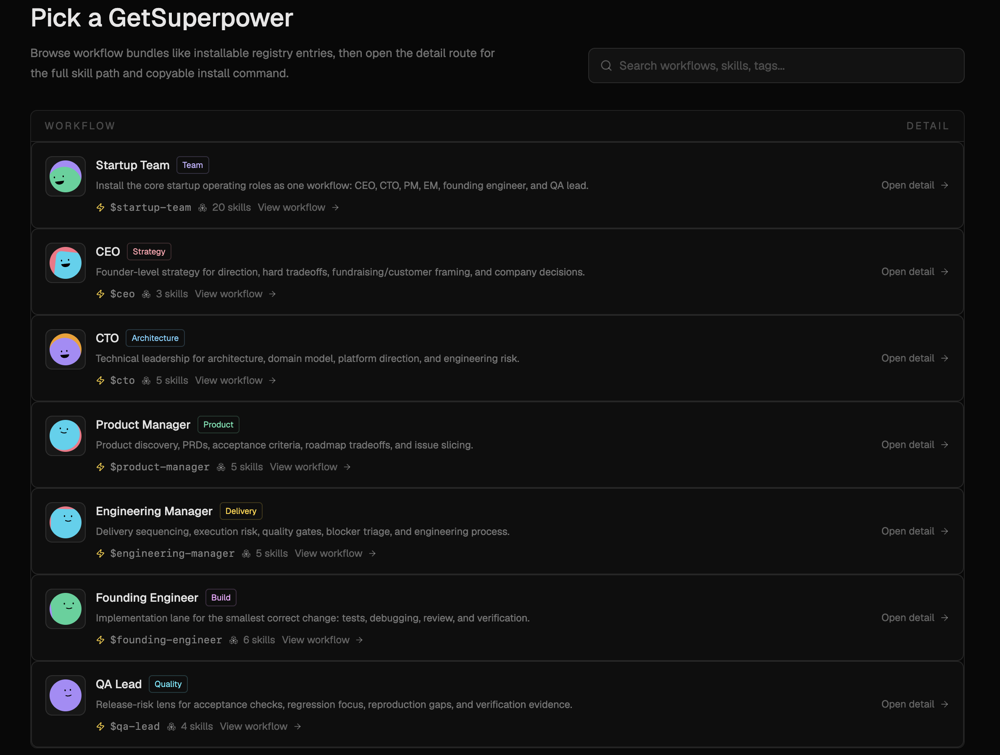

# GetSuperpower

[English](README.md)

本文件為繁體中文版本。

Power your ability.

GetSuperpower 是給 AI agents 使用的 many-skill bank：安裝一個 workflow skill
tree，帶著目標呼叫一個 entry skill，就能把適合當前問題的 roles、playbooks、verification
habits 交給你的 agent。核心很簡單：3x your ability，而不用手動切換每個 specialist skill。

當你想把 company-building goal 交給多個 role workflows 推進，而不是手動 juggling 每個 skill
時，先從 Startup Goal 開始：CEO、CTO、Product Manager、Engineering Manager、Founding
Engineer、QA Lead。


## 快速開始

安裝完整的 startup goal workflow：

```bash
npx getsuperpower@latest install startup-goal
```

然後請你的 agent 帶著目標執行 entry skill：

```text
$startup-goal I have an AI bookkeeping idea; help me choose the wedge and ship a v1 in two weeks
```

這個 alias 會指向 repo 內已提交的 workflow bundle：

```bash
npx getsuperpower@latest install 'https://github.com/0xroylee/getsuperpower.git#examples/workflows/startup-goal'
```

如果你只需要單一 specialist workflow，也可以安裝個別 startup roles：

```bash
npx getsuperpower@latest install ceo
npx getsuperpower@latest install cto
npx getsuperpower@latest install product-manager
npx getsuperpower@latest install engineering-manager
npx getsuperpower@latest install founding-engineer
npx getsuperpower@latest install qa-lead
```

安裝 skills 後，請重新啟動你的 agent，讓它重新載入新的 entry skills。

## Workflow Registry

使用 registry view 挑選一個 GetSuperpower、檢視它的 role workflow，並複製 install command。



## Startup Role Workflows

| GetSuperpower | Entry skill | 用途 |
| --- | --- | --- |
| Startup Goal | `$startup-goal` | 讓 company-building goal 依序經過 strategy、product、architecture、delivery、implementation、QA role subagents。 |
| CEO | `$ceo` | Direction、hard tradeoffs、fundraising/customer framing、company decisions。 |
| CTO | `$cto` | Architecture、domain model、platform direction、engineering risk。 |
| Product Manager | `$product-manager` | Product discovery、PRDs、acceptance criteria、roadmap tradeoffs、issue slicing。 |
| Engineering Manager | `$engineering-manager` | Delivery sequencing、execution risk、quality gates、blocker triage、engineering process。 |
| Founding Engineer | `$founding-engineer` | The smallest correct implementation change：tests、debugging、review、verification。 |
| QA Lead | `$qa-lead` | Release-risk review、acceptance checks、regression focus、reproduction gaps、verification evidence。 |

每個 workflow 仍然只是你可以檢查的檔案：`workflow.json`、README、local skills。它的力量來自於一次安裝 skill
tree，然後呼叫知道該使用哪些 companion skills 的 entry skill。

## Goal Loops

有些 GetSuperpowers 也提供 loop runner，適合需要持續推進直到完成的 goals。loop 是可恢復的 workflow state：
`loop start` 建立 run，`loop status` 顯示狀態，`loop advance` 回傳下一個 suggested action。

runtime 是 action-only。它會記錄狀態並回傳下一個 suggested action；它不會默默替 agent 執行 tools 或 shell commands。

試試 loop-capable product-development workflow：

```bash
npx getsuperpower@latest loop start grilled-product-dev --json
npx getsuperpower@latest loop status grilled-product-dev --latest --json
npx getsuperpower@latest loop advance grilled-product-dev --run <run-id> --json
```

這種形狀適合複雜工作：釐清 goal、推進一個 action、驗證 evidence，然後持續 advance 直到 goal 完成。

## Built-In Workflow Ecosystem

GetSuperpower workflows 可以組合 local skills、bundled skills、external skill packs：

- Matt Pocock skills：TDD、review、design pressure-testing、domain modeling、PRDs、issue slicing。
- Superpowers skills：brainstorming、planning、execution、verification。
- Ponytrail evidence：為宣告 `pony-trail` 的 workflows 記錄 file-change rationale、verification、rollback context。
- More workflow packs are coming.

`getsuperpower install` 會使用每個 workflow skill 的 `repo` metadata，透過 Skills CLI 抓取缺少的 external
skills。例如：
`{ "source": "superpowers:brainstorming", "repo": "obra/superpowers" }`
會在 `source` 保留原始 skill name，並用
`npx skills add obra/superpowers --skill brainstorming` 安裝它。

如果 automatic bootstrap 失敗，請透過 GetSuperpower 執行 package install，然後重試：

```bash
npx getsuperpower@latest skills install mattpocock/skills
```

## Command Reference

```bash
npx getsuperpower@latest install <alias-or-path-or-git-url>
npx getsuperpower@latest list
npx getsuperpower@latest deps <source>
npx getsuperpower@latest lock <source>
npx getsuperpower@latest loop <start|status|log|advance|summary> <source>
npx getsuperpower@latest remove <workflow-name>
npx getsuperpower@latest init <name>
npx getsuperpower@latest validate <source>
npx getsuperpower@latest skills install
npx getsuperpower@latest skills update
```

執行 `npx getsuperpower@latest --help` 或
`npx getsuperpower@latest <command> --help` 查看詳細用法。

較舊的 `bundle` 和 `workflow` commands 仍可作為 compatibility aliases 使用。

## 建立自己的 GetSuperpower

如果你想 author 並分享 workflow bundle，請先閱讀 [Create Your Own Workflow guide](docs/workflow-author-guide.md)。

建立新的 GetSuperpower：

```bash
npx getsuperpower@latest init release-review
```

這會建立：

```text
release-review/
  workflow.json
  README.md
  skills/
    release-review/
      SKILL.md
    custom-review/
      SKILL.md
```

`skills/release-review/SKILL.md` 是 entry skill。當你希望使用者呼叫一個 skill 來協調多個 sub-skills 時，請編輯它。

如果你希望 agent 協助設計 bundle skills，可以安裝 authoring helper：

```bash
npx getsuperpower@latest skills install creating-bundle-skills
```

然後要求你的 agent 使用：

```text
$creating-bundle-skills create a GetSuperpower for release review
```

分享前請先驗證：

```bash
npx getsuperpower@latest validate ./release-review
npx getsuperpower@latest deps ./release-review
```

完整指南在 [`docs/workflow-author-guide.md`](docs/workflow-author-guide.md)。

## Examples

| Example | 適合用途 | Notes |
| --- | --- | --- |
| `examples/workflows/startup-goal` | 圍繞一個 goal 安裝 realistic startup operating bench。 | 包含 `$startup-goal`、`$ceo`、`$cto`、`$product-manager`、`$engineering-manager`、`$founding-engineer`、`$qa-lead`。 |
| `examples/workflows/ceo` | Company direction、strategy、tradeoffs、decision mapping。 | Uses Matt Pocock decision and grilling skills. |
| `examples/workflows/cto` | Architecture、domain model、technical risk、review。 | Uses Matt Pocock architecture/review skills. |
| `examples/workflows/product-manager` | Discovery、PRD、issue slicing、product planning。 | Uses Superpowers plus Matt Pocock PRD/issue skills. |
| `examples/workflows/engineering-manager` | Delivery sequencing、quality gates、execution risk。 | Uses planning, TDD, diagnosing, and review skills. |
| `examples/workflows/founding-engineer` | Implementation、tests、debugging、review、final verification。 | Uses `$implement` as the implementation role. |
| `examples/workflows/qa-lead` | Acceptance checks、regression focus、release verification。 | Uses review, diagnosing, and verification skills. |
| `examples/workflows/grilled-product-dev` | 將 product-development work 形成 approved plan 的 goal loops。 | Provides `loop start`, `loop status`, and `loop advance`. |
| `examples/workflows/openspec-superpowers` | OpenSpec delivery 的 compatibility/demo workflow。 | Kept for one release while the role catalog becomes the primary example set. |
| `examples/workflows/development-design-delivery` | Product-minded engineering 的 compatibility/demo workflow。 | Richer composition example with Ponytrail evidence. |
| `examples/workflows/real-engineering` | 組合 RTK、Ponytrail、Superpowers、Matt Pocock skills 的 compatibility/demo workflow。 | Fetches Matt Pocock skills if missing. |
| `examples/workflows/release-review` | Release-risk review 的 compatibility/demo workflow。 | Good minimal example. |

## Installed Files

預設情況下，CLI 會將 installed workflow records 寫入 home directory：

```text
~/
.getsuperpower/
  workflows/
```

當你明確需要 project-local workflow record 時，請使用 `--dir <project>`。

除非你明確想分享 installed workflow records，否則請不要把 project-local `.getsuperpower/` folders 加進 git。

## Local Development

```bash
bun install
bun run build
bun test
bun run check
bun scripts/smoke-public-git-install.ts
```

Landing app：

```bash
cd landing
bun install
bun run dev
bun run build
```

## Compatibility

Package 和 CLI binary 的名稱都是 `getsuperpower`。
