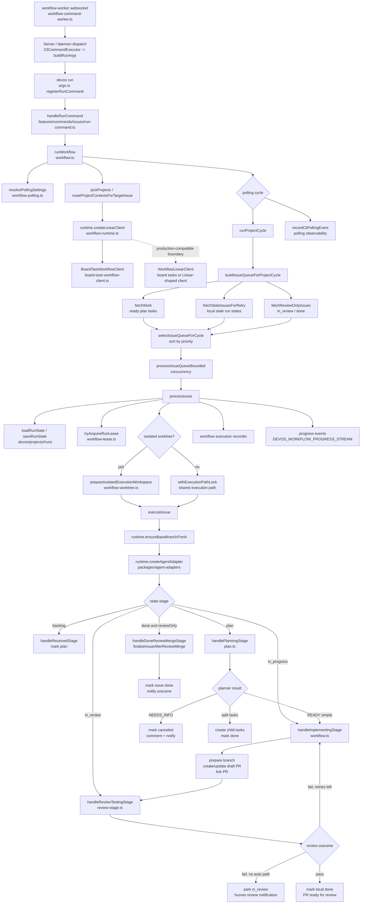

# CLI Workflow Source Diagram

This diagram maps the main control flow in `packages/cli/src/features/workflow`.
Read it from top to bottom: command entry builds `RunOptions`, workflow cycles
select work, issue execution acquires safety guards, then the stage machine calls
agent and integration boundaries.

## Stage State Machine

`executeIssue` is the stage router. It keeps looping until the run state reaches
`done`, `canceled`, or `failed`.

```mermaid
stateDiagram-v2
  [*] --> plan: new ready task
  [*] --> in_review: review-only task
  backlog --> plan: handleReceivedStage

  plan --> canceled: planner NEEDS_INFO
  plan --> in_progress: simple READY plan
  plan --> done: planner splits into child tasks

  in_progress --> in_review: implementation creates or updates PR

  in_review --> in_progress: review fails and auto-fix pass remains
  in_review --> in_review: review fails and needs human updates
  in_review --> done: review passes; PR ready

  done --> done: review-only merge gate may squash merge
  done --> [*]
  canceled --> [*]
  failed --> [*]
```

## Source Ownership

| Concern | Primary files |
| --- | --- |
| CLI command parsing | `packages/cli/src/args.ts` |
| CLI run command handler | `packages/cli/src/features/commands/issues/run-command.ts` |
| Server/daemon command dispatch | `packages/cli/src/features/server/cli-command-executor.ts`, `packages/cli/src/features/daemon/workflow-command-worker.ts` |
| Main workflow loop and stage router | `packages/cli/src/features/workflow/workflow.ts` |
| Planning stage | `packages/cli/src/features/workflow/plan.ts` |
| Review/testing stage | `packages/cli/src/features/workflow/review-stage.ts` |
| Queueing, retry selection, concurrency | `packages/cli/src/features/workflow/workflow-queue.ts` |
| Run-state persistence | `packages/cli/src/features/workflow/state.ts` |
| Leases | `packages/cli/src/features/workflow/workflow-lease.ts` |
| Isolated worktrees | `packages/cli/src/features/workflow/workflow-worktree.ts` |
| Runtime integration boundary | `packages/cli/src/features/workflow/workflow-runtime.ts` |
| Board-task workflow client | `packages/cli/src/features/workflow/board-task-workflow-client.ts` |

## Mental Model

1. `args.ts` turns CLI flags into `RunOptions`.
2. `runWorkflow` chooses projects and repeats cycles when polling is enabled.
3. `runProjectCycle` gathers eligible work, merges stale retry candidates, sorts
   the queue, and runs bounded workers.
4. `processIssue` is the safety wrapper: local state, identity refresh, lease,
   execution-path lock, optional isolated worktree, recorder, cleanup.
5. `executeIssue` is the actual state machine: plan, implement, review, and
   finalize.
6. `WorkflowRuntime` keeps side effects behind a boundary: task client, agent
   adapter, GitHub operations, worktree management, PR comments, merges, and
   notifications.
