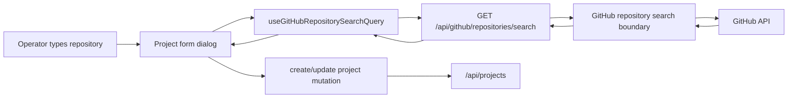

# Live GitHub Repository Search For Projects

## Scope

Add live GitHub repository search to the project create/edit workflow. Operators
should be able to type a repository name, owner/repo pair, or GitHub URL while
creating or editing a project, select a live GitHub result, and save the project
with `repoOwner`, `repoName`, and `baseBranch` populated from that selection.

This spec covers the server API boundary, web API client plumbing, and project
form behavior. It does not change workflow execution, project routing, GitHub PR
automation, or database schema.

## Current State

The Projects page lives under `packages/web/src/components/projects`. The
existing New project dialog stores repository input in a single `repositoryUrl`
field and parses only GitHub clone URLs in
`packages/web/src/components/projects/projects-panel-utils.ts`.

The server already accepts project create and update payloads with repository
metadata through `/api/projects` and `/api/projects/:id`. The web UI currently
uses create-only project mutation plumbing and does not expose an edit-project
flow.

## Goals

1. Let operators find GitHub repositories by live search instead of requiring a
   clone URL.
2. Reuse one project form shape for create and edit so repository behavior is
   consistent.
3. Keep GitHub auth, rate-limit handling, and network errors behind the server
   API boundary.
4. Preserve the existing project table and project list data contracts.
5. Keep the implementation project-agnostic and Bun-only.

## Non-Goals

1. Do not clone repositories or inspect local worktrees.
2. Do not add new project database columns.
3. Do not search non-GitHub providers.
4. Do not move workflow GitHub logic from the CLI into the web package.
5. Do not implement organization/account connection management in this change.

## Recommended Approach

Use a server-backed GitHub repository search endpoint. The web UI sends a
debounced query to the server, the server calls GitHub with server-side
credentials or local GitHub CLI-compatible auth, and the server returns a small
normalized result list.

This keeps secrets out of the browser and gives the UI a stable contract:
repository search either returns concise results or a predictable error. It also
keeps the future implementation free to swap the GitHub lookup mechanism without
rewriting the Projects page.

## API Design

Add a route in the server HTTP layer:

```text
GET /api/github/repositories/search?q=<query>
```

Response:

```ts
interface GitHubRepositorySearchResponse {
  repositories: GitHubRepositorySearchResult[];
}

interface GitHubRepositorySearchResult {
  id: string;
  owner: string;
  name: string;
  fullName: string;
  htmlUrl: string;
  cloneUrl: string;
  defaultBranch: string;
  description: string | null;
  isPrivate: boolean;
}
```

The endpoint should trim the query and reject blank input with `400`. It should
limit results to a small count, such as 8 or 10, to keep the picker predictable.

Server lookup should live behind a narrow module, for example
`packages/server/src/github/github-repository-search.ts`, with runtime types
under `packages/server/src/github/types/`. The HTTP route should map service
results into JSON responses and avoid embedding GitHub-specific error text that
could expose tokens, URLs with credentials, or private details.

## Query Semantics

The web field accepts three operator input forms:

1. `owner/repo`
2. `repo-name`
3. GitHub HTTPS or SSH URL

For GitHub URLs and `owner/repo`, the UI should still be able to parse owner and
repo locally so project saving is possible after a user picks or enters an exact
repository. Live search should be used to confirm and enrich the selection with
the default branch.

For bare repo names, the server should search GitHub and return ranked results.
The UI should require a selected result before saving a repository for a bare
name; otherwise the project may be saved with no repository if the field is
cleared.

## Web UI Design

Create a reusable project form dialog for both new and edit flows. The Projects
table should gain a compact edit action for each row. Opening edit pre-fills the
form from the selected project, including repository label `owner/name` when
present.

The repository input becomes a repository picker:

1. User types a GitHub URL, `owner/repo`, or search text.
2. Web API query debounces live search while the field has enough text.
3. Results show `owner/name`, default branch, visibility, and optional
   description.
4. Selecting a result stores `repoOwner`, `repoName`, and `baseBranch`.
5. Saving sends those fields through the existing project create/update payload.

The field should remain keyboard-friendly and responsive. It should not require
live search for projects without repositories; blank repository input remains
valid and maps to null repository fields.

## Data Flow



## Error Handling

The server should map common failures to stable responses:

1. Blank or too-short query: `400` with a concise validation message.
2. Missing GitHub authentication: `503` with a message that search is
   unavailable until GitHub auth is configured.
3. GitHub rate limit or secondary rate limit: `429`.
4. Network or upstream failures: `502` or `503`.

The web picker should show inline search errors without blocking project saves
that do not include a repository. If the operator typed a bare name and did not
select a result, the form should ask for a selected repository result or a valid
GitHub URL/owner-repo value.

## Testing

Server tests should cover:

1. Successful repository search response mapping.
2. Blank query validation.
3. Missing auth and upstream error mapping.
4. Route registration and method handling.

Web tests should cover:

1. Repository input parsing for URL and `owner/repo` forms.
2. Create request mapping from a selected search result.
3. Update request mapping for edited project repository fields.
4. API client response parsing for repository search results and errors.

Visible UI changes should be verified with the local web app in a browser after
implementation. Package-level checks should include the relevant web and server
typechecks/tests, followed by the root quality gates when the implementation is
complete.

## Risks

1. GitHub search auth may differ between local development and deployed
   environments. The implementation should centralize the lookup boundary so
   the credential source can evolve without changing the UI.
2. Search result ranking can be surprising for short bare names. The picker
   should show enough owner/repo context that operators can choose deliberately.
3. Project update support may touch existing cache invalidation. The update
   mutation should update the workspace project list cache and invalidate the
   affected project board query if needed.

## Success Criteria

1. Creating a project can populate repository metadata from a live GitHub search
   result.
2. Editing a project can change or clear repository metadata.
3. Pasted GitHub URLs and exact `owner/repo` input still work.
4. GitHub credentials remain server-side.
5. Search failures are visible but do not break project creation without a
   repository.
