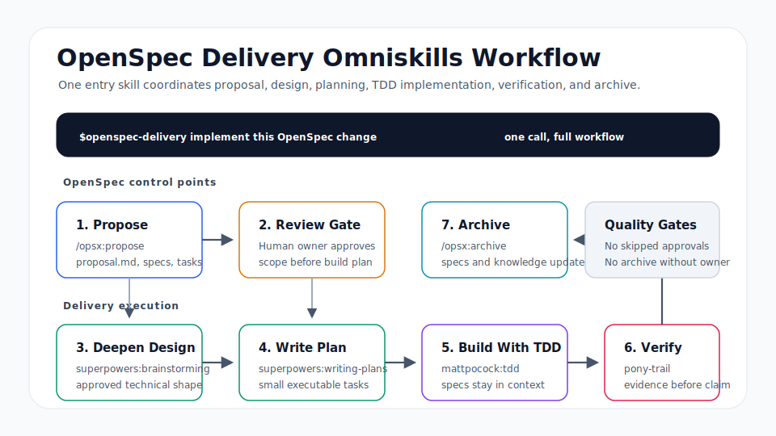

# OpenSpec Delivery Omniskills Workflow

This example turns an OpenSpec delivery loop into an installable Omniskills workflow
reference. The user calls one professional entry skill, and that skill
coordinates proposal, design, planning, implementation, verification, and
archive work.



It models a closed AI-assisted delivery loop:

1. OpenSpec runs `/opsx:propose` to define scope and generate `proposal.md`,
   `specs/`, and `tasks.md`.
2. The human owner reviews `proposal.md` before implementation planning starts.
3. `tasks.md` hands the approved scope to Superpowers.
4. Superpowers uses `brainstorming` and `writing-plans` to deepen the design and
   split the work into smaller implementation tasks.
5. Implementation runs task by task with TDD, using `specs/` for context.
6. Verification evidence is recorded before delivery is claimed.
7. OpenSpec runs `/opsx:archive` to fold the finished change back into the main
   specs and project knowledge.

The callable entry skill is:

```text
skills/openspec-delivery/SKILL.md
```

After install and agent restart, invoke:

```text
$openspec-delivery implement this OpenSpec change
```

## Key Handoff Points

| Stage | Lead | Output |
| --- | --- | --- |
| Proposal and specs | OpenSpec | Change scope, spec docs, and task list |
| Design deepening | Superpowers | Technical details and implementation plan |
| Coding execution | Superpowers | TDD-driven implementation with `specs/` context |
| Quality verification | Superpowers | Verification evidence before delivery |
| Knowledge archive | OpenSpec | Updated specs and project knowledge |

## Dependencies

This Omniskills workflow combines local OpenSpec handoff guidance with reusable agent
skills:

- `./skills/openspec-delivery`
- `./skills/opsx-handoff-review`
- `superpowers:brainstorming`
- `superpowers:writing-plans`
- `mattpocock:tdd`
- `superpowers:verification-before-completion`

`omniskill install` automatically uses the Skills CLI to fetch missing
`mattpocock:*` dependencies. If that automatic bootstrap fails, run the same
package install through the CLI and retry:

```bash
bun run dev -- skills install mattpocock/skills
```

## Try It

Validate this Omniskills workflow from the repo root:

```bash
bun run dev -- validate examples/workflows/openspec-superpowers
```

List its dependencies:

```bash
bun run dev -- deps examples/workflows/openspec-superpowers
```

Install it into a project:

```bash
bun run dev -- install examples/workflows/openspec-superpowers
```

Restart the agent app after install so the `$openspec-delivery` entry skill
and its sub-skills are available.
